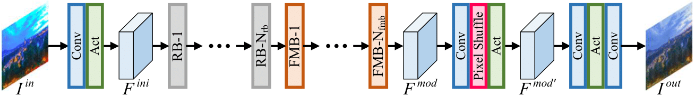
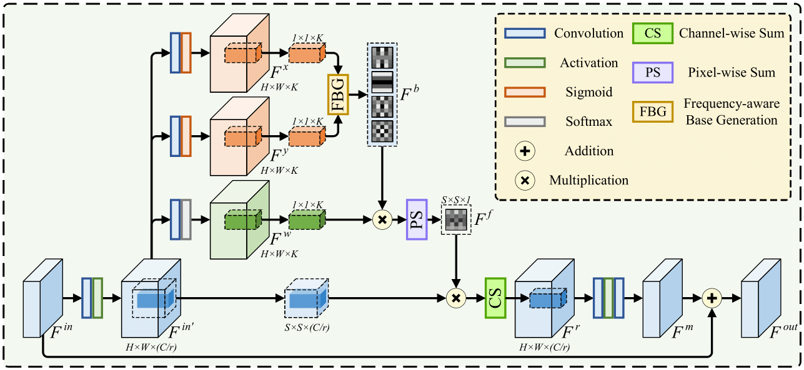
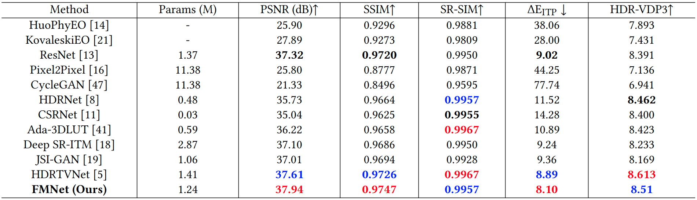
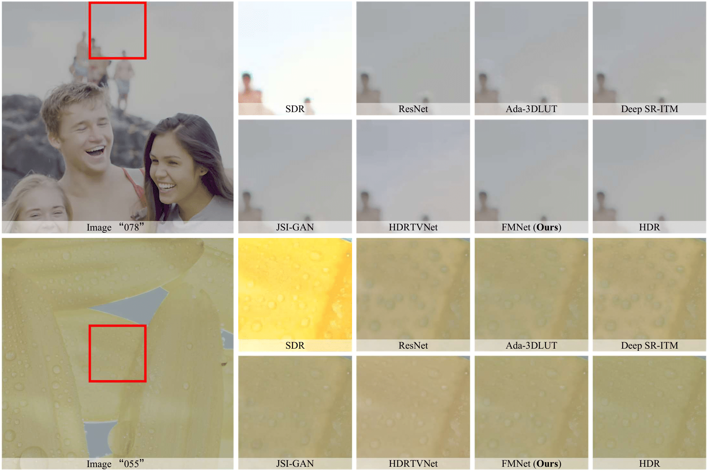

<p align="center">
  
</p>

This is the official PyTorch implementation of FMNet in the ACM MM 2022 paper "[FMNet: Frequency-Aware Modulation Network for SDR-to-HDR Translation](https://dl.acm.org/doi/10.1145/3503161.3548016)".

# Updates
- 2022.10.09 Init the repositories.

# Contents
0. [Introduction](#Introduction)
0. [Requirement](#Requirement)
0. [Dataset](#Dataset)
0. [Demo](#Demo)
0. [Train](#Train)
0. [Test](#Test)
0. [Results](#Results)
0. [Citation](#Citation)
0. [Acknowledgment](#Acknowledgment)
0. [Contact](#Contact)
0. [License](#License)

# Introduction

High-dynamic-range (HDR) media resources that preserve high contrast and more details in shadow and highlight areas in television are becoming increasingly popular for modern display technology compared to the widely available standard-dynamic-range (SDR) media resources. However, due to the exorbitant price of HDR cameras, researchers have attempted to develop the SDR-to-HDR techniques to convert the abundant SDR media resources to the HDR versions for cost-saving. Recent SDR-to-HDR methods mostly apply the image-adaptive modulation scheme to dynamically modulate the local contrast. However, these methods often fail to properly capture the low-frequency cues, resulting in artifacts in the low-frequency regions and low visual quality. Motivated by the Discrete Cosine Transform (DCT), in this paper, we propose a Frequency-aware Modulation Network (FMNet) to enhance the contrast in a frequency-adaptive way for SDR-to-HDR translation. Specifically, we design a frequency-aware modulation block that can dynamically modulate the features according to its frequency-domain responses. This allows us to reduce the structural distortions and artifacts in the translated low-frequency regions and reconstruct high-quality HDR content in the translated results. Experimental results on the HDRTV1K dataset show that our FMNet outperforms previous methods and the perceptual quality of the generated HDR images can be largely improved.

<p align="center">
  
</p>

<p align="center">
  
</p>

# Requirement

1. Python 3.6.10

2. NVIDIA GPU

3. NVIDIA CUDA 10.0.130

4. Python Package:
```
torchvision==0.9.1
opencv_contrib_python==4.5.1.48
numpy==1.18.1
torch==1.8.1
scipy==1.5.4
matplotlib==3.3.3
PyYAML==5.3.1
tensorboardX==2.2
```

# Dataset
We use the [HDRTV1K](https://github.com/chxy95/HDRTVNet#configuration) dataset for training and evaluation.
You can obtain this dataset from [HDRTVNet](https://github.com/chxy95/HDRTVNet#configuration).
Once you have downloaded the HDRTV1K dataset, you can reorganize the dataset to get a folder with the following structure:
```
hdrtv1k
├── training_set
|   ├── train_hdr
|   |   └── *.png
|   └── train_sdr
|       └── *.png
└── test_set
    ├── test_hdr
    |   └── *.png
    └── test_sdr
        └── *.png
```
You should move this dataset into ```$ROOT/data/``` folder and then prepare the training set through:
```
cd $ROOT/codes
python preprocessing.py --input_folder ../data/hdrtv1k/training_set/train_sdr --save_folder ../data/hdrtv1k/training_set/train_sdr_sub_c096_s240 --n_thread 20 --crop_sz 96 --step 240 --thres_sz 48 --compression_level 0
python preprocessing.py --input_folder ../data/hdrtv1k/training_set/train_hdr --save_folder ../data/hdrtv1k/training_set/train_hdr_sub_c096_s240 --n_thread 20 --crop_sz 96 --step 240 --thres_sz 48 --compression_level 0
```

# Demo
### 1. Get pretrained model
Our pretrained model ```fmnet_final.pth``` has been placed into the ```$ROOT/checkpoints``` folder.

### 2. Inference
You can generate the HDR results through:
```
cd $ROOT/codes
python inference.py --test_hdr ../data/hdrtv1k/test_set/test_hdr --test_sdr ../data/hdrtv1k/test_set/test_sdr --config ./options/train/fmnet_final.yml --parameter ../checkpoints/fmnet_final.pth
```
The HDR results will be placed in the ```$ROOT/experiments/fmnet_final/val_images``` folder.

# Train
### 1. Set up configuration
Our training settings can be found at ```$ROOT/codes/options/train/fmnet_final.yml```.
Please carefully check the hyperparameters inside this config file.

### 2. Train the FMNet
You can train the FMNet following the configuration in ```$ROOT/codes/options/train/fmnet_final.yml``` through:
```
cd $ROOT/codes
python train.py -opt options/train/fmnet_final.yml
```
You can find the saved checkpoints in the folder ```$ROOT/experiments/fmnet_final/models```.

# Test
You should first download the ```hdr_toolbox``` via [HDR_Toolbox](https://github.com/banterle/HDR_Toolbox) and ```hdrvdp-3.0.6``` via [HDRVDP3](https://sourceforge.net/projects/hdrvdp/files/hdrvdp/3.0.6/), and place these two folder (```hdr_toolbox``` and ```hdrvdp-3.0.6```) into the ```$ROOT\codes``` folder.
Then you can evaluate the performance of FMNet with specific checkpoint ```*.pth``` using the [HDRTV1K](https://github.com/chxy95/HDRTVNet#configuration) dataset:
```
cd $ROOT/codes
python inference.py --test_hdr ../data/hdrtv1k/test_set/test_hdr --test_sdr ../data/hdrtv1k/test_set/test_sdr --config ./options/train/fmnet_final.yml --parameter ../experiments/fmnet_final/models/*.pth
```
Once the generated HDR results are placed in ```$ROOT/experiments/fmnet_final/val_images``` folder, you can evaluate the quantitative performance through :
```
cd $ROOT/codes
python evaluation.py --pd_folder ../experiments/fmnet_final/val_images --gt_folder ../data/hdrtv1k/test_set/test_hdr --norm 65535
```
Besides, you can also use Matlab to obtain the HDRVDP3 and SR-SIM scores through ```evaluation.m``` (remember to configure the input arguments in the Matlab file).

# Results
## Quantitative Results
Quantitative comparison of previous methods and ours on the HDRTV1K dataset:
<p align="center">
  
</p>

## Visual Results
Qualitative comparison of visual quality by different methods on the HDRTV1K dataset:
<p align="center">
  
</p>

# Citation
If you find the code helpful in your research or work, please cite our paper:
```BibTeX
@InProceedings{xu2022fmnet,
  author = {Gang Xu and Qibin Hou and Zhang Le and Ming-Ming Cheng},
  title = {FMNet: Frequency-Aware Modulation Network for SDR-to-HDR Translation},
  booktitle = {Proceedings of the 30th ACM International Conference on Multimedia},
  month = {October},
  year = {2022}
}
```

# Acknowledgment
Our code is built on [HDRTVNet](https://github.com/chxy95/HDRTVNet).
We thank the authors for sharing their codes.

# Contact
If you have any questions, feel free to E-mail me with [gangxu@mail.nankai.edu.cn](gangxu@mail.nankai.edu.cn).

# License
The code is released under the Creative Commons Attribution-NonCommercial-ShareAlike 4.0 International Public License for NonCommercial use only.
Any commercial use should get formal permission first.
